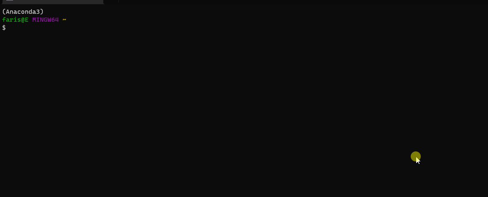
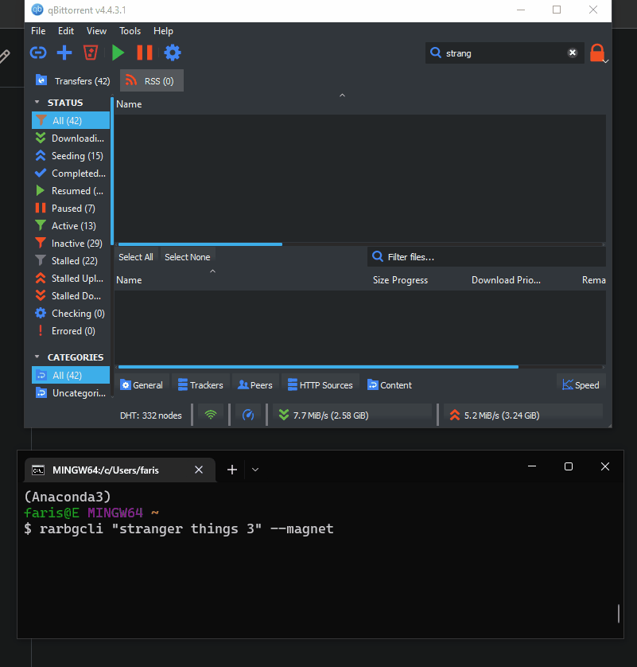
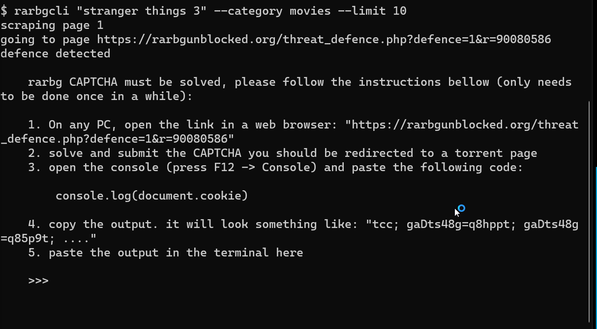

# [RARBG-CLI `rarbgcli`](https://github.com/FarisHijazi/rarbgcli)

RARBG command line interface for scraping the [rarbg.to](rarbg.to) torrent search engine.

Outputs a torrent information as JSON from a [rarbg.to](rarbg.to) search.



---

You can even pipe `|` the magnet links to your favorite bittorrent client



## Installation

From PyPi (stable)

    pip install rarbgcli

From source (latest)

    pip install git+https://github.com/FarisHijazi/rarbgcli

## Usage

Both aliases are valid for the same command: `rarbg` or `rarbgcli`

    usage:
        [-h] [--category {movies,xxx,music,tvshows,software,games,nonxxx,}] [--limit LIMIT] [--domain DOMAIN] [--order {data,filename,leechers,seeders,size,}] [--descending] [--interactive] [--download_torrents] [--magnet] [--sort {title,date,size,seeders,leechers,}]
        [--block_size SIZE] [--no_cache] [--no_cookie]
        search

    positional arguments:
    search                Search term

    optional arguments:
    -h, --help            show this help message and exit
    --category {movies,xxx,music,tvshows,software,games,nonxxx,}, -c {movies,xxx,music,tvshows,software,games,nonxxx,}
    --limit LIMIT, -l LIMIT
                            Limit number of torrent magnet links (default: inf)
    --domain DOMAIN       Domain to search, you could put an alternative mirror domain here (default: rarbgunblocked.org)
    --order {data,filename,leechers,seeders,size,}, -r {data,filename,leechers,seeders,size,}
                            Order results (before query) by this key. empty string means no sort (default: )
    --descending          Order in descending order (only available for --order) (default: False)
    --interactive, -i     Force interactive mode, show interctive menu of torrents (default: None)
    --download_torrents, -d
                            Open torrent files in browser (which will download them) (default: None)
    --magnet, -m          Output magnet links (default: False)
    --sort {title,date,size,seeders,leechers,}, -s {title,date,size,seeders,leechers,}
                            Sort results (after scraping) by this key. empty string means no sort (default: )
    --block_size SIZE, -B SIZE
                            Display torrent sizes in units of SIZE (default: auto)
    --no_cache, -nc       Don't use cached results from previous searches (default: False)
    --no_cookie, -nk      Don't use CAPTCHA cookie from previous runs (will need to resolve a new CAPTCHA) (default: False)

Example

```sh
rarbgcli "the stranger things 3" --category movies --limit 10 --magnet
```

### Piping `|`

The program is pipe-friendly, so you could use this tool in conjunction with the [jq](https://stedolan.github.io/jq/) command to filter the JSON output, and then pipe it to your favorite torrent client.

The `--magnet` option is a convenience option instead of filtering it every time with `jq`, the bellow 2 lines are equivalent:

```sh
rarbgcli "the stranger things 3" --category movies --limit 10 | jq .[].magnet | xargs qbittorrent
rarbgcli "the stranger things 3" --category movies --limit 10 --magnet | xargs qbittorrent
```

## CAPTCHA

CAPTCHA should automatically be solved using Selenium Chrome driver and `tesseract`.

In the case that it doesn't, see the instructions at the bottom to manually solve the CAPTCHA and save the cookies.

~To get around the captcha, the user will be prompted to solve it and enter the cookie in the terminal.~

~I tried many ways to automate this process (using selenium and tesseract), but it just ends up being overkill, hard to maintain across platforms, and I still didn't get it to work.~

~This might be automated one day, because it is possible.~



## Development

- make changes
- `./test.sh` # make sure tests pass
- `git commit ...`
- `./build.sh` # will push automatically

### To-do list

- [x] add interactive mode
- [x] add option to download the .torrent files
- [ ] add api options (for importing using python)
